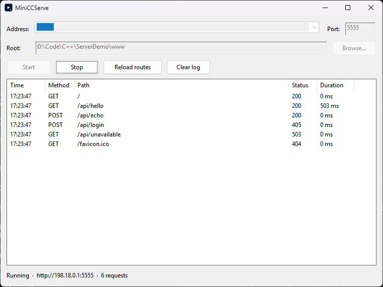

# MiniCCServe

A mini Windows desktop server for debugging service projects: static file
serving plus user-defined mock endpoints, in one small executable with no
dependencies.



## Why

When you are developing a client (mobile app, frontend, integration) against
a service that does not exist yet — or cannot be reached from your machine —
you need a stand-in server that answers in seconds, not a new microservice.
MiniCCServe serves files from any folder and returns canned responses from a
JSON route table you can edit with any text editor and hot-reload with one
click.

## Features

- **Static file server** — pick any folder as the root; directory listings
  when no `index.html` is present
- **Mock routes** — define endpoints (method, path, status, delay, body) in
  `routes.json` next to the exe; zero predefined endpoints, the tool has no
  opinions about your API
- **Bind address control** — listen on all interfaces (`0.0.0.0`), loopback
  only (`127.0.0.1`), or a specific adapter IP; the status bar shows the URL
  other machines on your LAN can use
- **Request log** — time, method, path, status and duration for every request,
  including your mock latency so timeouts are visible; double-click a row to
  inspect the exchanged bodies (JSON pretty-printed, up to 16 KB each), one
  click clears the view
- **Single binary** — statically linked C++ runtime, ~1.3 MB, runs on any
  Windows 10/11 x64 machine with nothing installed
- Thread-per-connection (up to 64 concurrent), HTTP/1.1 with `Connection:
  close`, request bodies up to 10 MB, path-traversal safe

## Quick start

1. Download `MiniCCServe.exe` from [Releases](../../releases) (or build it,
   see below) and put it anywhere
2. Run it — an example `routes.json` and an empty `www/` folder are created
   next to the exe on first start
3. Set port / address / root folder, press **Start**
4. Open `http://127.0.0.1:5555` (or the LAN URL shown in the status bar) in
   a browser

> When listening on `0.0.0.0`, Windows may show a firewall prompt on first
> start — allow it if other machines on your network need to connect.

## Mock routes (`routes.json`)

A JSON array next to the executable. Hot-reload with **Reload routes**; a
broken file never takes down the running server (the previous routes stay
active and the error is shown in the status bar).

```json
[
  {
    "method": "GET",
    "path": "/api/user/42",
    "status": 200,
    "delay_ms": 500,
    "json": { "id": 42, "name": "Ada" }
  },
  {
    "method": "POST",
    "path": "/api/login",
    "status": 401,
    "json": { "error": "invalid credentials" }
  },
  {
    "method": "GET",
    "path": "/api/bundle",
    "body_file": "fixtures/big-payload.json"
  }
]
```

| Field | Default | Meaning |
|---|---|---|
| `method` | `"GET"` | Exact match (`"POST"`, `"PUT"`, ...). Non-matching methods fall through to static files / 404 |
| `path` | *required* | Exact path match starting with `/`; no wildcards |
| `status` | `200` | Any HTTP status 100–599 |
| `delay_ms` | `0` | Artificial latency before responding (0–600000), visible in the request log |
| `content_type` | `application/json` | Response `Content-Type` header |
| `body` | — | Literal response body (string) |
| `json` | — | JSON value serialized as the response body — write payloads as real JSON, no double-escaping |
| `body_file` | — | Path of a file (relative to `routes.json`) served as the body — for large payloads |
| anything else | — | Ignored (e.g. `"comment"` fields are fine) |

Mock routes take priority over static files with the same path.

## Static files

- The root folder is chosen in the GUI (remembered in `settings.ini`),
  defaulting to `www/` next to the executable
- `/` serves `index.html` if present, otherwise a directory listing
- Common MIME types are recognized; unknown extensions are served as
  `application/octet-stream`
- `GET` and `HEAD` only; other methods get `405`

## Testing your endpoints

The server ships no test client — bring your own, like nginx. Point any HTTP
client at the URL shown in the status bar:

```sh
# simple GET with query parameters
curl "http://127.0.0.1:5555/api/hello?x=1"

# POST a JSON payload
curl -X POST -H "Content-Type: application/json" \
     -d '{"user":"ada","items":[1,2,3]}' \
     http://127.0.0.1:5555/api/echo

# form-urlencoded
curl -X POST -d "name=ada&role=admin" http://127.0.0.1:5555/api/login
```

Or use [Postman](https://www.postman.com/) / any REST client against
`http://127.0.0.1:5555`. What arrived — method, path, Content-Type and both
bodies — is one double-click away in the request log.

## Building

Requirements: CMake ≥ 3.21, Ninja, and one of the toolchains below.

### MSVC

From a *x64 Native Tools Command Prompt* (or use `scripts/build.ps1 msvc`,
which locates Visual Studio for you):

```bat
cmake --preset msvc-release
cmake --build --preset msvc-release
```

### MinGW-w64 (llvm-mingw)

Create `CMakeUserPresets.json` (gitignored) with your toolchain paths, then
build — or just run `scripts/build.ps1`:

```json
{
  "version": 3,
  "configurePresets": [
    {
      "name": "mingw-local",
      "inherits": "mingw-release",
      "binaryDir": "${sourceDir}/build/mingw",
      "cacheVariables": {
        "CMAKE_C_COMPILER": "C:/llvm-mingw/bin/x86_64-w64-mingw32-clang.exe",
        "CMAKE_CXX_COMPILER": "C:/llvm-mingw/bin/x86_64-w64-mingw32-clang++.exe",
        "CMAKE_RC_COMPILER": "C:/llvm-mingw/bin/x86_64-w64-mingw32-windres.exe"
      }
    }
  ],
  "buildPresets": [{ "name": "mingw-local", "configurePreset": "mingw-local" }]
}
```

```bat
cmake --preset mingw-local
cmake --build --preset mingw-local
```

Both toolchains build with warnings-as-strict (`/W4 /utf-8` and
`-Wall -Wextra -pedantic`) and link the C++ runtime statically, producing a
self-contained executable.

### Smoke test

After building, `scripts/smoke-test.py` (Python 3, standard library only)
launches the app, presses Start virtually and checks the HTTP endpoints:

```
python scripts/smoke-test.py --exe build/mingw/MiniCCServe.exe
```

## Project layout

```
src/       application code (GUI, HTTP server, router, config)
vendor/    cJSON (MIT) for routes.json parsing
res/       manifest (comctl32 v6 + PerMonitorV2 DPI + UTF-8), icon, version info
www/       default welcome page served on first start
scripts/   build helper, icon generator, smoke test
```

## License

[MIT](LICENSE). cJSON is vendored under its own
[MIT license](vendor/cJSON/LICENSE).
